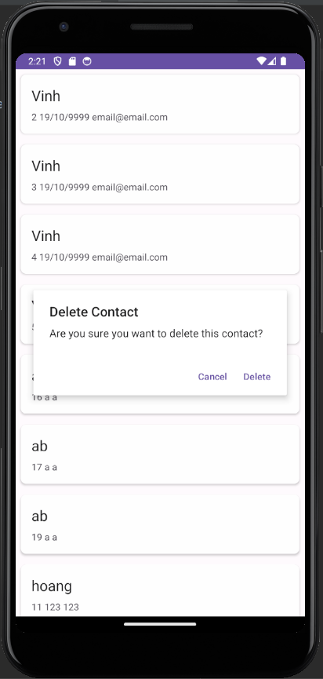

## Add Delete event listener to each card



To add a delete event to each card that allows the user to delete the corresponding item from the database, you can follow these steps:

## Update Adapter

Modify the `ContactAdapter` to handle the delete event. You can add a listener interface for communication between the adapter and the activity.

```java
// ContactAdapter.java
public class ContactAdapter extends RecyclerView.Adapter<ContactAdapter.ContactViewHolder> {
    private List<Person> persons;
    private OnDeleteClickListener onDeleteClickListener;

    public interface OnDeleteClickListener {
        void onDeleteClick(Person person);
    }

    public ContactAdapter(List<Person> persons, OnDeleteClickListener onDeleteClickListener) {
        this.persons = persons;
        this.onDeleteClickListener = onDeleteClickListener;
    }

    // ... other methods ...

    @Override
    public void onBindViewHolder(@NonNull ContactViewHolder holder, int position) {
        // Bind data as before...

        holder.itemView.setOnClickListener(v -> {
            if (onDeleteClickListener != null) {
                onDeleteClickListener.onDeleteClick(persons.get(position));
            }
        });
    }

    // ... other methods ...
}
```

## Modify DetailsActivity

Implement the `OnDeleteClickListener` interface in `DetailsActivity` and handle the delete event 

by showing a confirmation dialog and removing the item from the database.

```java
// DetailsActivity.java

public class DetailsActivity extends AppCompatActivity implements ContactAdapter.OnDeleteClickListener {
    // ...

    List<Person> persons;
    
    // ...

    @Override
    protected void onCreate(Bundle savedInstanceState) {
        // ...

        persons = appDatabase.personDao().getAllPersons();
        adapter = new ContactAdapter(persons, this);
        recyclerView.setAdapter(adapter);
    }

    @Override
    public void onDeleteClick(Person person) {
        new AlertDialog.Builder(this)
                .setTitle("Delete Contact")
                .setMessage("Are you sure you want to delete this contact?")
                .setPositiveButton("Delete", (dialog, which) -> {
                    // Remove from the database
                    appDatabase.personDao().deletePerson(person);

                    // Update the list
                    persons.remove(person);
                    adapter.notifyDataSetChanged();
                })
                .setNegativeButton("Cancel", null)
                .show();
    }
}
```

## Update Database

Make sure your `PersonDao` interface includes a method for deleting a person from the database.

```java
// PersonDao.java
@Dao
public interface PersonDao {
    // ...

    @Delete
    void deletePerson(Person person);
}

```