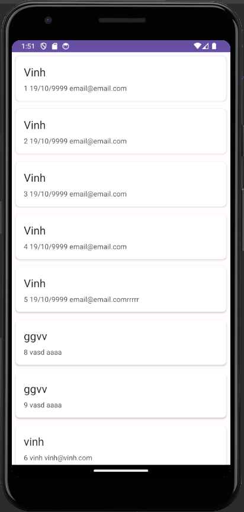

## What is Room Database

Most Android applications require local data storage. In the past years, we have achieved this through the use of SQLite databases. 

Room is a persistent library that is part of the Android jetpack. It is built on top of SQLite. 

The room persistent library has many advantages over raw SQLite.

One advantage is that it saves a developer from writing a lot of boilerplate code to create and manage databases. It also provides compile-time validation of SQL queries.

This means that an application won’t compile if there is an SQL query error. This prevents the developer from encountering run time errors.

The main components are:

- `Entity` - An entity is a class that is annotated with the @Entity annotation. This class represents a database table.
- `DAO` - A Data Access Object is used to map SQL queries to functions. It’s an interface annotated with the @DAO annotation.
- `Room Database` - This class acts as an access point to the SQL database. The class uses the DAO to issue queries to the SQL database.


## Refactor with Room Database

First, create these folders below

```bash
src
|-- models
|-- dao
|-- database
|-- activities
```

The diagram illustrates how these components work together



## Add Dependencies:
Make sure you have the necessary dependencies in your `build.gradle` file:

```bash
implementation "androidx.room:room-runtime:2.4.0"
annotationProcessor "androidx.room:room-compiler:2.4.0"
```

## Create Entity Class:
Create an Entity class that represents your data structure.

In the folder `models`, create `Person.java` class

```java
// /models/Person.java
import androidx.room.Entity;
import androidx.room.PrimaryKey;

@Entity(tableName = "persons")
public class Person {
    @PrimaryKey(autoGenerate = true)
    public long person_id;
    public String name;
    public String dob;
    public String email;
}
```

## Create DAO (Data Access Object) Interface:
Create a DAO interface to define the database operations.

In the `dao` folder, create `PersonDao.java` class

```java
// /dao/PersonDao.java
import androidx.room.Dao;
import androidx.room.Insert;
import androidx.room.Query;

import java.util.List;

@Dao
public interface PersonDao {
    @Insert
    long insertPerson(Person person);

    @Query("SELECT * FROM persons ORDER BY name")
    List<Person> getAllPersons();
}

```

## Create Room Database:
Create a Room Database class that defines your database instance and includes the DAO.

In the folder `database`, create the file `AppDatabase.java`

```java
// /database/AppDatabase.java
import androidx.room.Database;
import androidx.room.RoomDatabase;

@Database(entities = {Person.class}, version = 1)
public abstract class AppDatabase extends RoomDatabase {
    public abstract PersonDao personDao();
}
```

## Refactor `MainActivity`

Move the files `MainActivity.java` and `DetailsActivity.java` to folder `activities` and update them

```java
// /activities/MainActivity.java
import androidx.appcompat.app.AppCompatActivity;
import android.os.Bundle;
import android.view.View;
import android.widget.Button;
import android.widget.EditText;
import android.widget.Toast;

public class MainActivity extends AppCompatActivity {
    private AppDatabase appDatabase;

    @Override
    protected void onCreate(Bundle savedInstanceState) {
        super.onCreate(savedInstanceState);
        setContentView(R.layout.activity_main);

        appDatabase = Room.databaseBuilder(getApplicationContext(), AppDatabase.class, "sqlite_example_db")
                .allowMainThreadQueries() // For simplicity, don't use this in production
                .build();

        Button saveDetailsButton = findViewById(R.id.saveDetailsButton);

        saveDetailsButton.setOnClickListener(new View.OnClickListener() {
            @Override
            public void onClick(View view) {
                saveDetails();
            }
        });
    }

    private void saveDetails() {
        EditText nameTxt = findViewById(R.id.nameText);
        EditText dobTxt = findViewById(R.id.dobText);
        EditText emailTxt = findViewById(R.id.emailText);

        String name = nameTxt.getText().toString();
        String dob = dobTxt.getText().toString();
        String email = emailTxt.getText().toString();

        Person person = new Person();
        person.name = name;
        person.dob = dob;
        person.email = email;

        long personId = appDatabase.personDao().insertPerson(person);

        Toast.makeText(this, "Person has been created with id: " + personId,
                Toast.LENGTH_LONG
        ).show();


        // Launch Details Activity
        Intent intent = new Intent(this, DetailsActivity.class);
        startActivity(intent);
    }
}
```

```java
// /activities/DetailsActivity.java
import androidx.appcompat.app.AppCompatActivity;
import android.os.Bundle;
import android.widget.TextView;
import java.util.List;

public class DetailsActivity extends AppCompatActivity {
    private AppDatabase appDatabase;

    @Override
    protected void onCreate(Bundle savedInstanceState) {
        super.onCreate(savedInstanceState);
        setContentView(R.layout.activity_details);

        appDatabase = Room.databaseBuilder(getApplicationContext(), AppDatabase.class, "sqlite_example_db")
                .allowMainThreadQueries() // For simplicity, don't use this in production
                .build();

        TextView detailsTxt = findViewById(R.id.detailsText);

        List<Person> persons = appDatabase.personDao().getAllPersons();

        StringBuilder detailsBuilder = new StringBuilder();
        for (Person person : persons) {
            detailsBuilder.append(person.person_id).append(" ")
                    .append(person.name).append(" ")
                    .append(person.dob).append(" ")
                    .append(person.email).append("\n");
        }

        detailsTxt.setText(detailsBuilder.toString());
    }
}
```

Please note that the above code includes calls to Room Database methods on the main thread using `allowMainThreadQueries()` for simplicity. 

However, in a real app, you should use background threads or asynchronous methods to perform database operations.