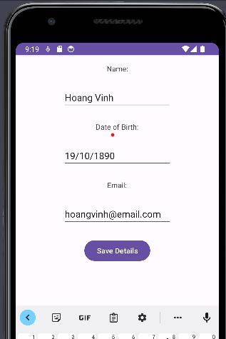
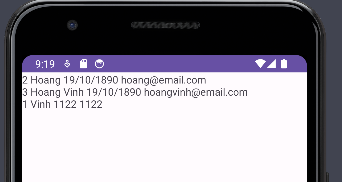
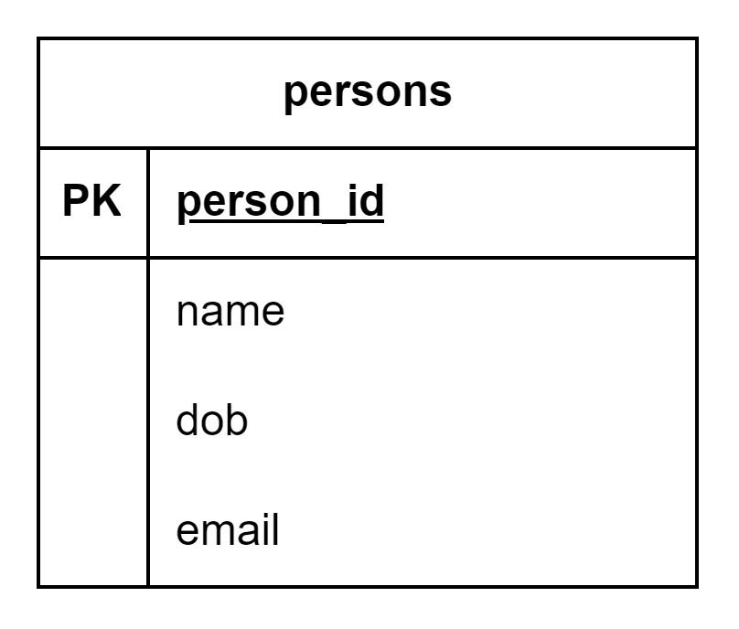

# Shared Preferences Example

Right-click on the project and select New > Android resource file.


Then, we create a `preferences.xml` file

```xml
<?xml version="1.0" encoding="utf-8"?>
<PreferenceScreen xmlns:android="http://schemas.android.com/apk/res/android">
    <CheckBoxPreference
        android:defaultValue="true"
        android:key="perform_updates"
        android:summary="Enable or disable data updates"
        android:title="Enable updates" />
    <ListPreference
        android:defaultValue="1000"
        android:dependency="perform_updates"
        android:entries="@array/updateInterval"
        android:entryValues="@array/updateIntervalValues"
        android:key="updates_interval"
        android:summary="Define how often updates will be performed"
        android:title="Updates interval" />
    <EditTextPreference
        android:defaultValue="Default welcome message"
        android:dialogMessage="Provide a message"
        android:dialogTitle="Welcome Message"
        android:key="welcome_message"
        android:summary="Define the Welcome message to be shown"
        android:title="Welcome Message" />
</PreferenceScreen>
```

Remember to create `updateIntervalValues` and `updateInterval` in `strings.xml`

```xml

<resources>
    <string name="app_name">comp1786-L5-android-persistence</string>
    <string-array name="updateInterval">
        <item name="1000">Every 1 second</item>
        <item name="5000">Every 5 seconds</item>
        <item name="30000">Every 30 seconds</item>
        <item name="60000">Every 1 minute</item>
        <item name="300000">Every 5 minutes</item>
    </string-array>
    <string-array name="updateIntervalValues">
        <item name="1000">1000</item>
        <item name="5000">5000</item>
        <item name="30000">30000</item>
        <item name="60000">60000</item>
        <item name="300000">300000</item>
    </string-array>
    <string name="action_settings">Settings</string>
</resources>
```

The android.preference package has been deprecated – we should use androidx.preference instead

- We will need to add a dependency for the new package
- Select File -> Project Structure and go the the Dependencies section





We will use a static inner class which inherits from PreferenceFragment

Add this code to `MainActivity.java`

```java
    public static class QuickPrefsFragment extends PreferenceFragmentCompat {
    @Override
    public void onCreatePreferences(@Nullable Bundle savedInstanceState, @Nullable String rootKey) {
        // Reads the preferences from our preferences resource file
        setPreferencesFromResource(R.xml.preferences, rootKey);
    }
}
```

Then, Add a second activity called `ShowSettingsActivity`


This should have a single TextView filling the entire screen called `settings_text_view`

```xml
<?xml version="1.0" encoding="utf-8"?>
<androidx.constraintlayout.widget.ConstraintLayout xmlns:android="http://schemas.android.com/apk/res/android"
    xmlns:app="http://schemas.android.com/apk/res-auto"
    xmlns:tools="http://schemas.android.com/tools"
    android:layout_width="match_parent"
    android:layout_height="match_parent"
    tools:context=".ShowSettingsActivity">

    <TextView
        android:id="@+id/settings_text_view"
        android:layout_width="wrap_content"
        android:layout_height="wrap_content"
        android:layout_marginTop="256dp"
        android:textSize="30sp"
        android:text="Settings Text View"
        app:layout_constraintEnd_toEndOf="parent"
        app:layout_constraintStart_toStartOf="parent"
        app:layout_constraintTop_toTopOf="parent" />
</androidx.constraintlayout.widget.ConstraintLayout>
```

Last week we looked at how to introduce a toolbar

- Add a Toolbar to the layout document



`activity_main.xml`

```xml
<?xml version="1.0" encoding="utf-8"?>
<androidx.constraintlayout.widget.ConstraintLayout xmlns:android="http://schemas.android.com/apk/res/android"
    xmlns:app="http://schemas.android.com/apk/res-auto"
    xmlns:tools="http://schemas.android.com/tools"
    android:layout_width="match_parent"
    android:layout_height="match_parent"
    tools:context=".MainActivity">

    <androidx.appcompat.widget.Toolbar
        android:id="@+id/toolbar"
        android:layout_width="409dp"
        android:layout_height="wrap_content"
        android:background="?attr/colorPrimary"
        android:minHeight="?attr/actionBarSize"
        android:theme="?attr/actionBarTheme"
        app:layout_constraintEnd_toEndOf="parent"
        app:layout_constraintStart_toStartOf="parent"
        app:layout_constraintTop_toTopOf="parent" />

</androidx.constraintlayout.widget.ConstraintLayout>
```

- Set the style to NoActionBar in `themes.xml`

```xml

<resources xmlns:tools="http://schemas.android.com/tools">
    <!-- Base application theme. -->
    <style name="Base.Theme.Comp1786L5androidpersistence"
        parent="Theme.Material3.DayNight.NoActionBar">
```

- Add a menu file (I called it `preferences_menu.xml`) with a single menu item (text is Settings)


```xml
<?xml version="1.0" encoding="utf-8"?>
<menu xmlns:app="http://schemas.android.com/apk/res-auto"
    xmlns:android="http://schemas.android.com/apk/res/android">
    <item
        android:id="@+id/action_settings"
        android:title="Settings"
        app:showAsAction="ifRoom"/>
</menu>
```

- Add code to `MainActivity.java` to add set the toolbar as the support
  action bar

```java
    @Override
    public boolean onCreateOptionsMenu(Menu menu) {
        // Inflate the menu
        getMenuInflater().inflate(R.menu.preferences_menu, menu);
        return true;
    }

    @Override
    public boolean onOptionsItemSelected(@NonNull MenuItem item) {
        if (item.getItemId() == R.id.action_settings){
            // Open ShowSettingsActivity
            startActivity(new Intent(this, ShowSettingsActivity.class));
            return true;
        }
        return false;
    }
```

In the function `onCreate()` of `MainActivity.java`, add following code to display the toolbar

```java
        // Get a reference from the toolbar
        Toolbar myToolBar = findViewById(R.id.toolbar);

        // Set toolbar as actionbar for the activity
        setSupportActionBar(myToolBar);
```

To ensure that the automatically generated preference settings don’t overlap with the menu, we will
add a `FrameLayout` to `activity_main.xml`

```xml
    <FrameLayout
        android:id="@+id/pref_content"
        android:layout_width="350dp"
        android:layout_height="623dp"
        android:layout_marginStart="8dp"
        android:layout_marginTop="8dp"
        android:layout_marginEnd="8dp"
        android:layout_marginBottom="8dp"
        app:layout_constraintBottom_toBottomOf="parent"
        app:layout_constraintEnd_toEndOf="parent"
        app:layout_constraintStart_toStartOf="parent"
        app:layout_constraintTop_toBottomOf="@+id/toolbar">

    </FrameLayout>
```

Add the following code to the `onCreate()` method in `MainActivity.java`

```java
// Fragments are displayed using a FragmentSupportManager
getSupportFragmentManager()
        // Fragments are added to an activity’s view using fragment transactions
        .beginTransaction()
        // We are loading the preferences into the FrameLayout we created
        // Replace content with the QuickPrefsFragment inner class
        .replace(R.id.pref_content, new QuickPrefsFragment())
        // Calling the commit() method will display the automatically generated preference settings
        .commit();
```

Add the following code to the `onCreate()` method in `ShowSettingsActivity.java`

```java
SharedPreferences sharedPreferences = PreferenceManager.getDefaultSharedPreferences(this);
        String strPrefs =
                sharedPreferences.getBoolean(
                        "perform_updates", false) + "\n"
                        + sharedPreferences.getString("updates_interval", "-1") + "\n"
                        + sharedPreferences.getString("welcome_message", "NULL"
                );
        TextView settingsTextView = (TextView) findViewById(R.id.settings_text_view);
        settingsTextView.setText(strPrefs);
```

Voila, we can create 2 activities and use Shared Preference to store data


Using the `Device File Explorer` we can have a look at the content of the file

Navigate `data` -> `dat`a -> `com.example.comp1786_l5_android_persistence` -> `shared_prefs`


