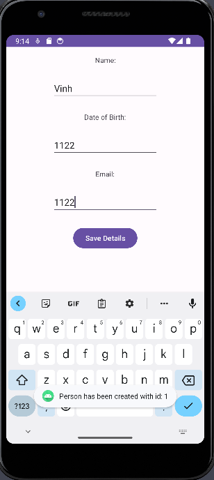

# Read - Write Demo

Replace the default TextView with a multiline EditText view in `activity_main.xml`

```xml
<?xml version="1.0" encoding="utf-8"?>
<androidx.constraintlayout.widget.ConstraintLayout xmlns:android="http://schemas.android.com/apk/res/android"
    xmlns:app="http://schemas.android.com/apk/res-auto"
    xmlns:tools="http://schemas.android.com/tools"
    android:layout_width="match_parent"
    android:layout_height="match_parent"
    tools:context=".MainActivity">


    <EditText
        android:id="@+id/textEditor"
        android:layout_width="wrap_content"
        android:layout_height="wrap_content"
        android:layout_marginTop="256dp"
        android:ems="10"
        android:inputType="text"
        app:layout_constraintEnd_toEndOf="parent"
        app:layout_constraintStart_toStartOf="parent"
        app:layout_constraintTop_toTopOf="parent" />
</androidx.constraintlayout.widget.ConstraintLayout>
```



Add a string constant to store the file name in `MainActivity.java`

```java
    private static final String NOTES_FILE_NAME = "notes.txt";
```

`onPause()` method

```java
    @Override
    public void onPause() {
        // Override the onPause() method and call the version in the super class
        super.onPause();

        try {
            // Create a private file, using the file name constant
            FileOutputStream out = openFileOutput(NOTES_FILE_NAME, Context.MODE_PRIVATE);

            // Get a reference to the EditText view
            EditText textEditor = findViewById(R.id.textEditor);

            // Add the content of the EditText view to the file
            out.write(textEditor.getText().toString().getBytes());

            // Close the output stream
            out.close();
        } catch (Exception e) {
            // Should be in a try/catch as with file I/O things can go wrong
            Toast
                    .makeText(this, "Exception " + e.toString(), Toast.LENGTH_LONG)
                    .show();
        }
    }
```

`onResume()` method

```java
    @Override
    protected void onResume() {
        super.onResume();

        try {
            // Opens the file using the same file name
            FileInputStream in = openFileInput(NOTES_FILE_NAME);
            if (in != null) {
                // If the file exists, create an InputStreamReader
                InputStreamReader tmp = new InputStreamReader(in);

                // Create a BufferedReader from the StreamReader
                BufferedReader reader = new BufferedReader(tmp);

                // Create a StringBuilder
                StringBuilder buf = new StringBuilder();

                // Some text is added, to show the text was loaded from file – not a good idea in real life
                buf.append("Restored content: \n");

                // Add all content to the StringBuilder
                String str = reader.readLine();
                while (str != null) {
                    buf.append(str + "\n");
                    str = reader.readLine();
                }

                in.close();
                EditText textEditor = findViewById(R.id.textEditor);

                // Display the content of the StringBuilder in the EditText view
                textEditor.setText(buf.toString());
            }
        } catch (FileNotFoundException e) {
        } catch (Exception e) {
            // Again, should be in try/catch
            Toast.makeText(this, "Exception " + e.toString(),
                    Toast.LENGTH_LONG
            ).show();
        }
    }
```

Write some text 


Put it to pause

Then re-launch 


