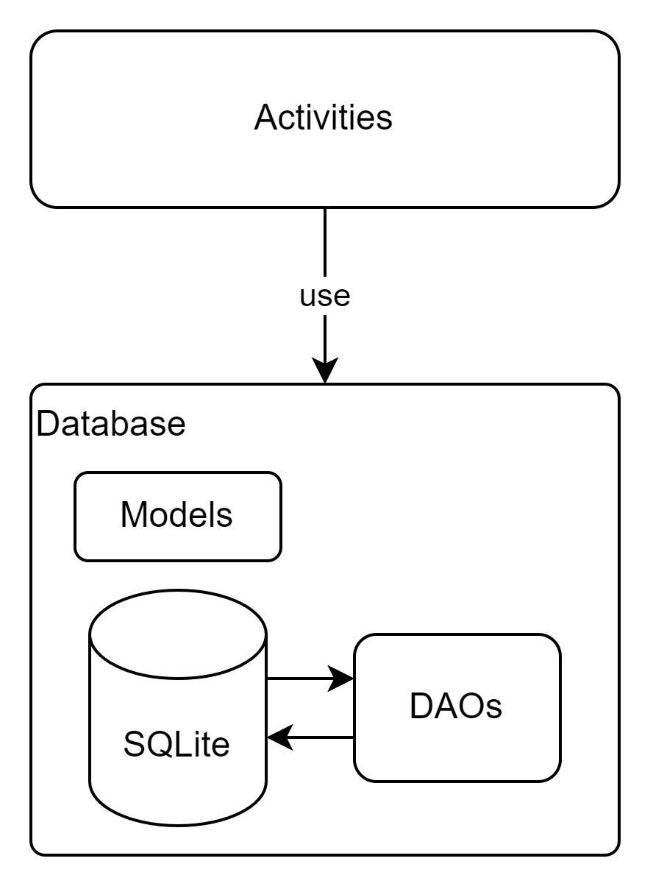
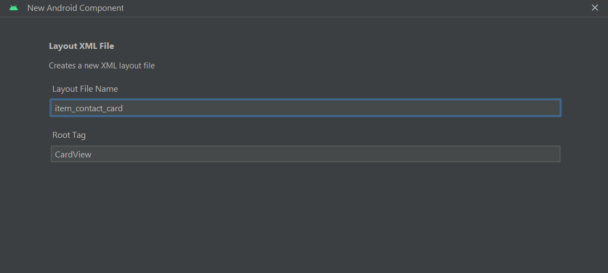

## Create dynamic lists with RecyclerView

RecyclerView makes it easy to efficiently display large sets of data. You supply the data and define how each item looks, and the RecyclerView library dynamically creates the elements when they're needed.

As the name implies, RecyclerView recycles those individual elements. When an item scrolls off the screen, RecyclerView doesn't destroy its view. Instead, RecyclerView reuses the view for new items that have scrolled onscreen. 

RecyclerView improves performance and your app's responsiveness, and it reduces power consumption.

In this refactor session, we will use `RecyclerView` and `CardView` to improve the UI



## Create Card Layout

First, create a layout file for the card that will represent each contact. Create a new XML layout file: `item_contact_card.xml`




`item_acontact_card.xml`
```xml
<?xml version="1.0" encoding="utf-8"?>
<androidx.cardview.widget.CardView xmlns:android="http://schemas.android.com/apk/res/android"
    xmlns:app="http://schemas.android.com/apk/res-auto"
    xmlns:tools="http://schemas.android.com/tools"
    android:id="@+id/contactCard"
    android:layout_width="match_parent"
    android:layout_height="wrap_content"
    android:layout_margin="8dp"
    app:cardCornerRadius="8dp">

    <!-- Customize this layout as per your requirements -->
    <LinearLayout
        android:layout_width="match_parent"
        android:layout_height="wrap_content"
        android:orientation="vertical"
        android:padding="16dp">

        <TextView
            android:id="@+id/personName"
            android:layout_width="wrap_content"
            android:layout_height="wrap_content"
            android:text=""
            android:textAppearance="@style/TextAppearance.AppCompat.Large" />

        <TextView
            android:id="@+id/personDetails"
            android:layout_width="wrap_content"
            android:layout_height="wrap_content"
            android:text=""
            android:layout_marginTop="8dp" />
    </LinearLayout>
</androidx.cardview.widget.CardView>
```

## Create Adapter

You will need to create a RecyclerView Adapter to bind your data to the card layout. Create a new Java class: `ContactAdapter.java`.

```java
// ContactAdapter.java
public class ContactAdapter extends RecyclerView.Adapter<ContactAdapter.ContactViewHolder> {
    private List<Person> persons;

    public ContactAdapter(List<Person> persons) {
        this.persons = persons;
    }

    @NonNull
    @Override
    public ContactViewHolder onCreateViewHolder(@NonNull ViewGroup parent, int viewType) {
        View itemView = LayoutInflater.from(parent.getContext()).inflate(com.example.comp1786_l5_android_persistence.R.layout.item_contact_card, parent, false);
        return new ContactViewHolder(itemView);
    }

    @Override
    public void onBindViewHolder(@NonNull ContactViewHolder holder, int position) {
        Person person = persons.get(position);
        holder.personName.setText(person.name);
        holder.personDetails.setText(person.person_id + " " + person.dob + " " + person.email);
    }

    @Override
    public int getItemCount() {
        return persons.size();
    }

    public static class ContactViewHolder extends RecyclerView.ViewHolder {
        TextView personName, personDetails;

        public ContactViewHolder(@NonNull View itemView) {
            super(itemView);
            personName = itemView.findViewById(R.id.personName);
            personDetails = itemView.findViewById(R.id.personDetails);
        }
    }
}
```

## Modify DetailsActivity

Update the `DetailsActivity.java` to use the RecyclerView and the new adapter.

```java
// DetailsActivity.java
public class DetailsActivity extends AppCompatActivity {
    private AppDatabase appDatabase;
    private RecyclerView recyclerView;
    private ContactAdapter adapter;

    @Override
    protected void onCreate(Bundle savedInstanceState) {
        super.onCreate(savedInstanceState);
        setContentView(R.layout.activity_details);

        appDatabase = Room.databaseBuilder(getApplicationContext(), AppDatabase.class, "details_db")
                .allowMainThreadQueries() // For simplicity, don't use this in production
                .build();

        recyclerView = findViewById(R.id.recyclerView);
        recyclerView.setLayoutManager(new LinearLayoutManager(this));

        List<Person> persons = appDatabase.personDao().getAllPersons();

        adapter = new ContactAdapter(persons);
        recyclerView.setAdapter(adapter);
    }
}
```

`LayoutManager` in recyclerView helps us to figure out how we need to display the items on the screen. It can be linearly or in a grid. 

`RecyclerView` provides by default a few implementations of layoutManager out of the box.

It is like the governing body of recyclerView which tells the recyclerView's adapter when to create a new view.


## XML Layout Update

Modify your `activity_details.xml` layout to include the RecyclerView.

```xml
<?xml version="1.0" encoding="utf-8"?>
<androidx.constraintlayout.widget.ConstraintLayout xmlns:android="http://schemas.android.com/apk/res/android"
    xmlns:app="http://schemas.android.com/apk/res-auto"
    xmlns:tools="http://schemas.android.com/tools"
    android:layout_width="match_parent"
    android:layout_height="match_parent"
    tools:context=".activities.DetailsActivity">

    <androidx.recyclerview.widget.RecyclerView
        android:id="@+id/recyclerView"
        android:layout_width="match_parent"
        android:layout_height="match_parent"
        app:layout_constraintStart_toStartOf="parent"
        app:layout_constraintTop_toTopOf="parent"
        app:layout_constraintEnd_toEndOf="parent"
        app:layout_constraintBottom_toBottomOf="parent" />

</androidx.constraintlayout.widget.ConstraintLayout>
```