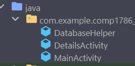
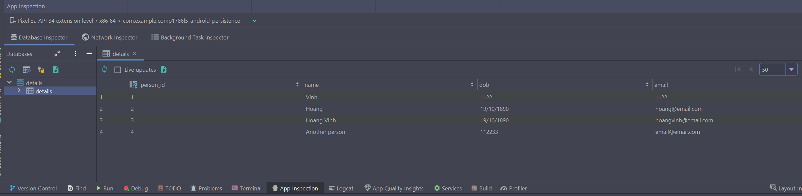

# Contact Database Sqlite

First, we create the layout in `activity_main.xml`

```xml
<?xml version="1.0" encoding="utf-8"?>
<androidx.constraintlayout.widget.ConstraintLayout xmlns:android="http://schemas.android.com/apk/res/android"
    xmlns:app="http://schemas.android.com/apk/res-auto"
    xmlns:tools="http://schemas.android.com/tools"
    android:layout_width="match_parent"
    android:layout_height="match_parent"
    tools:context=".MainActivity">

    <TextView
        android:id="@+id/name"
        android:layout_width="wrap_content"
        android:layout_height="wrap_content"
        android:layout_marginTop="16dp"
        android:text="Name:"
        app:layout_constraintEnd_toEndOf="parent"
        app:layout_constraintStart_toStartOf="parent"
        app:layout_constraintTop_toTopOf="parent" />

    <EditText
        android:id="@+id/nameText"
        android:layout_width="wrap_content"
        android:layout_height="wrap_content"
        android:layout_marginTop="24dp"
        android:ems="10"
        android:inputType="textPersonName"
        android:text=""
        app:layout_constraintEnd_toEndOf="parent"
        app:layout_constraintStart_toStartOf="parent"
        app:layout_constraintTop_toBottomOf="@+id/name" />

    <TextView
        android:id="@+id/dob"
        android:layout_width="wrap_content"
        android:layout_height="wrap_content"
        android:layout_marginTop="24dp"
        android:text="Date of Birth:"
        app:layout_constraintEnd_toEndOf="parent"
        app:layout_constraintHorizontal_bias="0.498"
        app:layout_constraintStart_toStartOf="parent"
        app:layout_constraintTop_toBottomOf="@+id/nameText" />

    <EditText
        android:id="@+id/dobText"
        android:layout_width="wrap_content"
        android:layout_height="wrap_content"
        android:layout_marginTop="24dp"
        android:ems="10"
        android:inputType="textPersonName"
        android:text=""
        app:layout_constraintEnd_toEndOf="parent"
        app:layout_constraintStart_toStartOf="parent"
        app:layout_constraintTop_toBottomOf="@+id/dob" />

    <TextView
        android:id="@+id/email"
        android:layout_width="wrap_content"
        android:layout_height="wrap_content"
        android:layout_marginTop="24dp"
        android:text="Email:"
        app:layout_constraintEnd_toEndOf="parent"
        app:layout_constraintHorizontal_bias="0.498"
        app:layout_constraintStart_toStartOf="parent"
        app:layout_constraintTop_toBottomOf="@+id/dobText" />

    <EditText
        android:id="@+id/emailText"
        android:layout_width="wrap_content"
        android:layout_height="wrap_content"
        android:layout_marginTop="24dp"
        android:ems="10"
        android:inputType="textPersonName"
        android:text=""
        app:layout_constraintEnd_toEndOf="parent"
        app:layout_constraintStart_toStartOf="parent"
        app:layout_constraintTop_toBottomOf="@+id/email" />

    <Button
        android:id="@+id/saveDetailsButton"
        android:layout_width="wrap_content"
        android:layout_height="wrap_content"
        android:layout_marginTop="24dp"
        android:text="Save Details"
        app:layout_constraintEnd_toEndOf="parent"
        app:layout_constraintStart_toStartOf="parent"
        app:layout_constraintTop_toBottomOf="@+id/emailText" />

</androidx.constraintlayout.widget.ConstraintLayout>
```
## Overview of the Project

The project will have the `DatabaseHelper` to manage all CRUD actions to the sqlite

Then, other activities will use the `DatabaseHelper` to perform CRUD operations


## Code

First, we create `DatabaseHelper.java` class. It will create the database with the design below


```java
import android.content.Context;
import android.database.sqlite.SQLiteDatabase;
import android.database.sqlite.SQLiteOpenHelper;
import android.util.Log;

public class DatabaseHelper extends SQLiteOpenHelper {
    private static final String DATABASE_NAME = "sqlite_example";
    // A set of constants to store the column and table names
    private static final String TABLE_NAME = "persons";
    public static final String ID_COLUMN = "person_id";
    public static final String NAME_COLUMN = "name";
    public static final String DOB_COLUMN = "dob";
    public static final String EMAIL_COLUMN = "email";

    private SQLiteDatabase database;

    private static final String TABLE_CREATE = String.format(
        // The SQL query to create the table
        // %s expects a value of any type
        // The query will be:
        // CREATE TABLE persons(
        //      person_id INTEGER PRIMARY KEY AUTOINCREMENT,
        //      name TEXT,
        //      dob TEXT,
        //      email TEXT
        // )
        "CREATE TABLE %s (" +
                "%s INTEGER PRIMARY KEY AUTOINCREMENT, " +
                "%s TEXT, " +
                "%s TEXT, " +
                "%s TEXT)",
        TABLE_NAME, ID_COLUMN, NAME_COLUMN, DOB_COLUMN, EMAIL_COLUMN
    );

    // The constructor makes a call to the method in the super class, passing the database name
    public DatabaseHelper(Context context) {
        super(context, DATABASE_NAME, null, 1);
        database = getWritableDatabase();
    }

    // Overriding the onCreate() method which generates the database
    @Override
    public void onCreate(SQLiteDatabase db) {
        db.execSQL(TABLE_CREATE);
    }

    // This method upgrades the database if the version number changes
    @Override
    public void onUpgrade(SQLiteDatabase db, int oldVersion, int newVersion) {
        db.execSQL("DROP TABLE IF EXISTS " + TABLE_NAME);

        Log.v(this.getClass().getName(), TABLE_NAME +
                "database upgrade to version" + newVersion + " - old data lost"
        );
        onCreate(db);
    }
}
```

Add two functions `getDetails()` and `insertDetails()`

```java
public class DatabaseHelper extends SQLiteOpenHelper {
    
    // ... (previous code)
    
    // Returns the automatically generated primary key
    public long insertDetails(String name, String dob, String email) {
        // ContentValues represents a single table row as a key/value map
        ContentValues rowValues = new ContentValues();

        rowValues.put(NAME_COLUMN, name);
        rowValues.put(DOB_COLUMN, dob);
        rowValues.put(EMAIL_COLUMN, email);

        return database.insertOrThrow(
                TABLE_NAME,
                // nullColumnHack specifies a column that will be set to null if the ContentValues argument contains no data
                null,
                // Inserts ContentValues into the database
                rowValues
        );
    }

    public String getDetails() {
        // The query will be:
        // SELECT person_id, name, dob, email
        // FROM persons
        // ORDER BY name
        Cursor results = database.query(TABLE_NAME,
                // Defines the query to execute
                new String[]{ID_COLUMN, NAME_COLUMN, DOB_COLUMN, EMAIL_COLUMN},
                null, null, null, null, NAME_COLUMN
        );
        String resultText = "";

        // Moves to the first position of the result set
        results.moveToFirst();

        // Checks whether there are more rows in the result set
        while (!results.isAfterLast()) {

            // Extracts the values from the row
            int id = results.getInt(0);
            String name = results.getString(1);
            String dob = results.getString(2);
            String email = results.getString(3);

            // Concatenates the text values
            resultText += id + " " + name + " " + dob + " " + email + "\n";

            // Moves to the next row in the result set
            results.moveToNext();
        }

        // Returns a long string of all results
        return resultText;
    }
}
```

The diagram below shows how to insert a new row to database


The diagram below illustrates how to extract the data from `results`


Then, update the `MainActivity.java` to use `DatabaseHelper` class

```java
public class MainActivity extends AppCompatActivity {

    @Override
    protected void onCreate(Bundle savedInstanceState) {
        super.onCreate(savedInstanceState);
        setContentView(R.layout.activity_main);

        Button saveDetailsButton = findViewById(R.id.saveDetailsButton);

        saveDetailsButton.setOnClickListener(new View.OnClickListener() {
            @Override
            public void onClick(View view) {
                saveDetails();
            }
        });
    }


    private void saveDetails() {
        // Creates an object of our helper class
        DatabaseHelper dbHelper = new DatabaseHelper(this);

        // Get references to the EditText views and read their content
        EditText nameTxt = findViewById(R.id.nameText);
        EditText dobTxt = findViewById(R.id.dobText);
        EditText emailTxt = findViewById(R.id.emailText);

        String name = nameTxt.getText().toString();
        String dob = dobTxt.getText().toString();
        String email = emailTxt.getText().toString();

        // Calls the insertDetails method we created
        long personId = dbHelper.insertDetails(name, dob, email);

        // Shows a toast with the automatically generated id
        Toast.makeText(this, "Person has been created with id: " + personId,
                Toast.LENGTH_LONG
        ).show();
    }
}
```

Voila, we can store data to SQLite


To see the data, first we create `DetailsActivity.java`



Layout of `activity_details.xml`

```xml
<?xml version="1.0" encoding="utf-8"?>
<androidx.constraintlayout.widget.ConstraintLayout xmlns:android="http://schemas.android.com/apk/res/android"
    xmlns:app="http://schemas.android.com/apk/res-auto"
    xmlns:tools="http://schemas.android.com/tools"
    android:layout_width="match_parent"
    android:layout_height="match_parent"
    tools:context=".DetailsActivity">

    <TextView
        android:id="@+id/detailsText"
        android:layout_width="wrap_content"
        android:layout_height="wrap_content"
        android:text=""
        app:layout_constraintStart_toStartOf="parent"
        app:layout_constraintTop_toTopOf="parent" />

</androidx.constraintlayout.widget.ConstraintLayout>
```

Add these codes in `MainActivity.java` to start `DetailsActivity`

```java
    // Launch Details Activity
    Intent intent = new Intent(this, DetailsActivity.class);
    startActivity(intent);
```

Inside `DetailsActivity`, add code below to display all data

```java
public class DetailsActivity extends AppCompatActivity {

    @Override
    protected void onCreate(Bundle savedInstanceState) {
        super.onCreate(savedInstanceState);
        setContentView(R.layout.activity_details);

        // Also declares an object of our helper class
        DatabaseHelper db = new DatabaseHelper(this);

        // Call the getDetails method we created
        String details = db.getDetails();

        TextView detailsTxt = findViewById(R.id.detailsText);

        // The text returned is just displayed
        detailsTxt.setText(details);
    }
}
```

Voila, we can see all data in `DetailsActivity` now


As of Android Studio 4.1 we can directly opening SQLite file from within the IDE

This is done via the App Inspector


